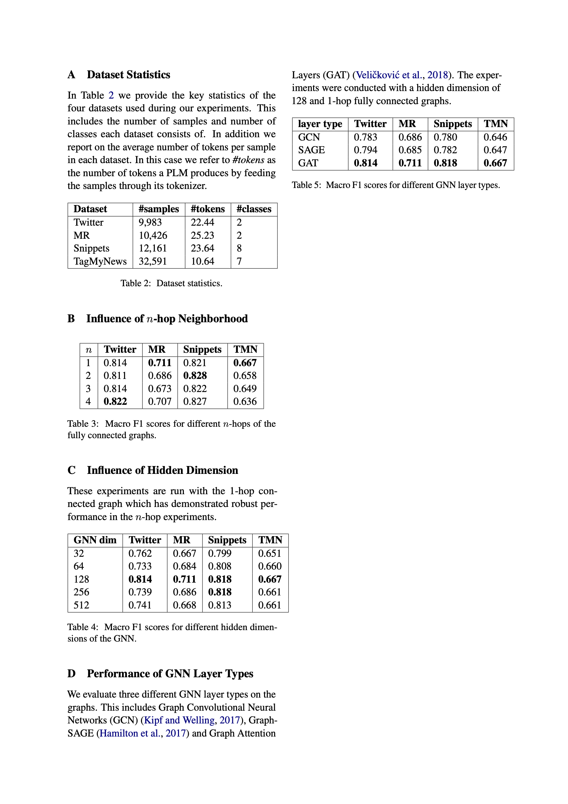

# TokenGraph

If you use our approach please cite our work as follows:
```
@inproceedings{donabauer2025token,
author = {Donabauer, Gregor and Kruschwitz, Udo},
title = {Token-Level Graphs for Short Text Classification},
year = {2025},
isbn = {978-3-031-88713-0},
publisher = {Springer-Verlag},
address = {Berlin, Heidelberg},
url = {https://doi.org/10.1007/978-3-031-88714-7_42},
doi = {10.1007/978-3-031-88714-7_42},
booktitle = {Advances in Information Retrieval: 47th European Conference on Information Retrieval, ECIR 2025, Lucca, Italy, April 6–10, 2025, Proceedings, Part III},
pages = {427–436},
numpages = {10},
keywords = {Pre-trained Language Models, Text Classification, GNNs},
location = {Lucca, Italy}
}
```

This repository contains all code and pre-processed data to rerun the TokenGraph classification experiments. The text
graphs can be downloaded from [Google Drive](https://drive.google.com/file/d/1X4K9SAGnrFA1liy2vOJlpYXpc2ZZz5LG/view?usp=sharing)
and the `graphs` folder with subfolders for each dataset should be placed in the
`TokenGraph` folder. It is also possible to put the raw data in the `TokenGraph` folder and rerun graph creation as
part of the `main.py` script. The code to run training and evaluation is also located in `main.py`. There is a CONFIG
at the top of the script that allows to set different parameters (e.g., dataset to use, hyperparameters).


Below, we provide results for different ablation studies that we performed to evaluate the robustness of our approach.
